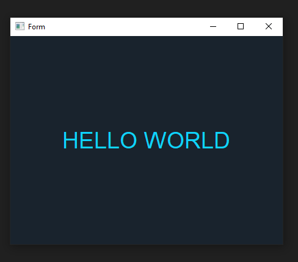

# PyQt5 Boilerplate

## Tutorial

1. Download QtDesigner from [this link](https://build-system.fman.io/qt-designer-download "this link").
2. Associate `.ui` files with QTDesigner so you can edit the gui easily.

## How to use

1. Clone the repo and enter its directory.
2. Execute the command `python -m venv env`.
3. Run `pip_init.bat`.
4. Modify `main.py` and `gui.ui` files on the `src` folder as you desire.
5. Execute `run.bat`, it will automatically compile the gui (if needed) and run the app.
